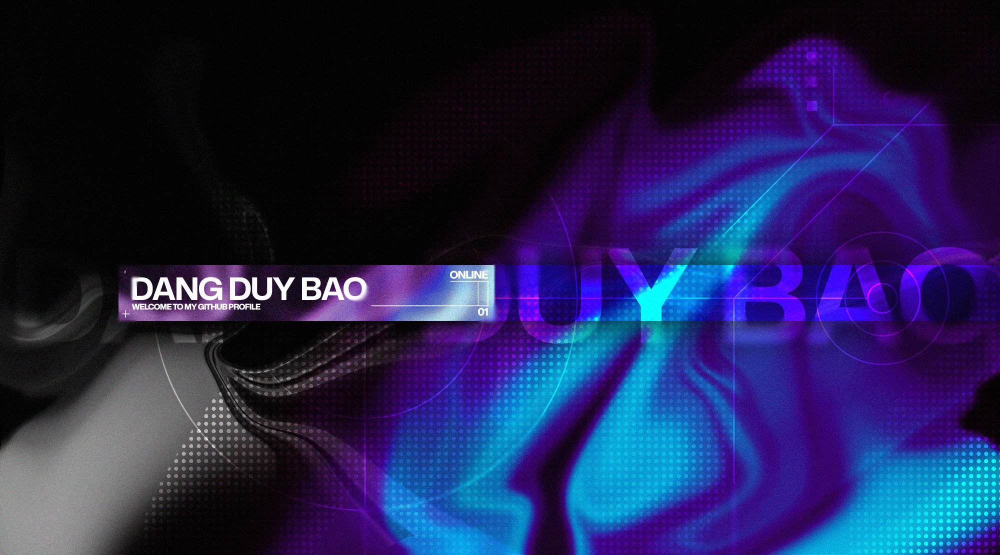

  

<h1 align='center'><samp><strong>Welcome to a space where ideas meet technology.</strong></samp></h1>

### 💫 About Me
I’m a Vietnamese Software Engineer with a strong interest in using technology to solve real-world problems and make everyday experiences better. I enjoy turning ideas into reliable, intuitive, and practical products that put users at the center of the development process.

What motivates me most is the opportunity to create technology that goes beyond simply working — solutions that provide real value and make a meaningful difference in people’s lives. I’m constantly exploring new technologies, experimenting with creative ideas, and looking for better ways to turn them into tangible products.

At the moment, I’m particularly interested in Generative AI, and I’m excited to connect with people who share the same passion for building innovative products. I’m always open to new opportunities, collaborations, and challenging projects where I can learn, contribute, and create something impactful.
